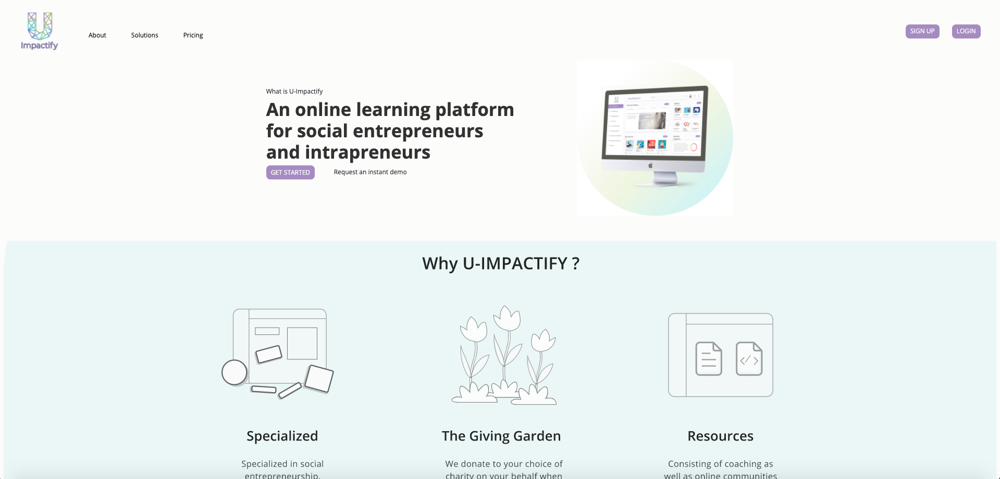
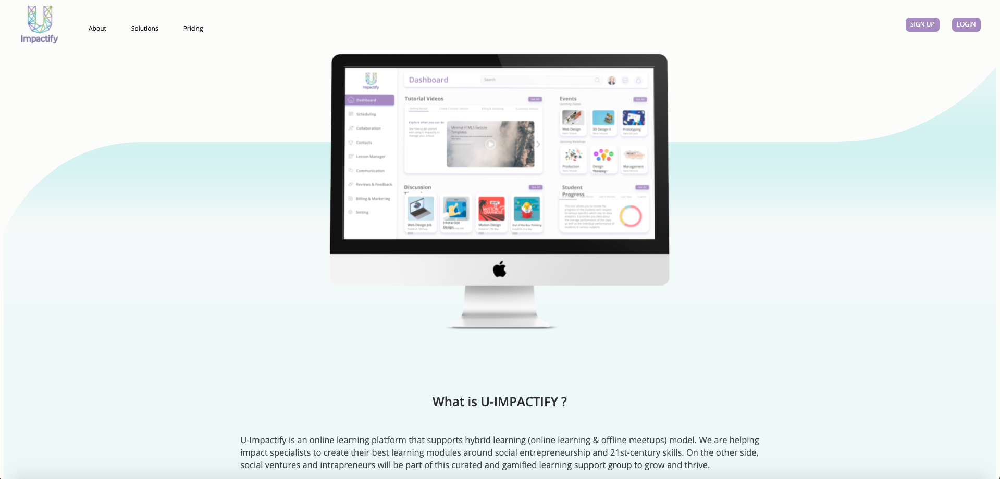
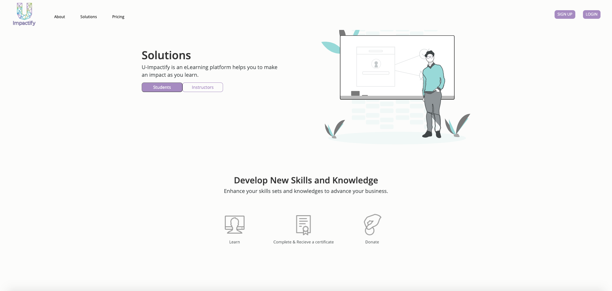
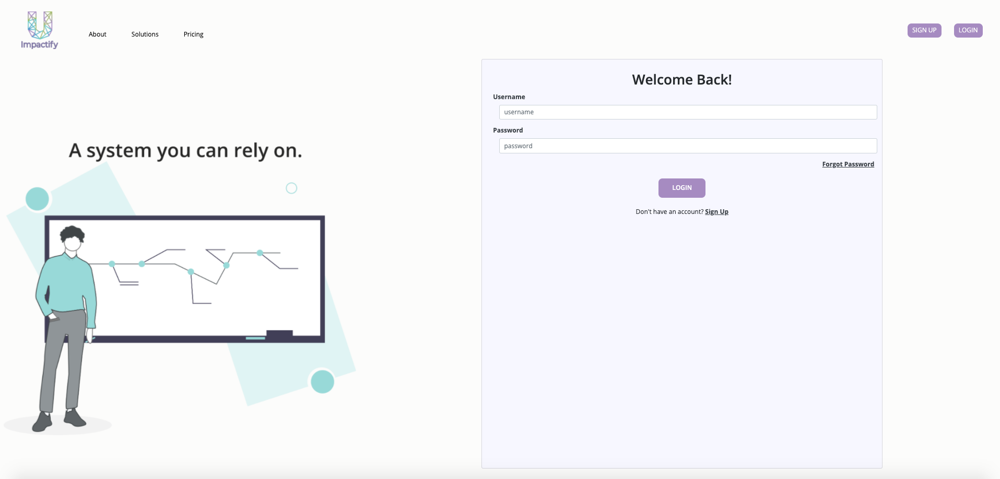
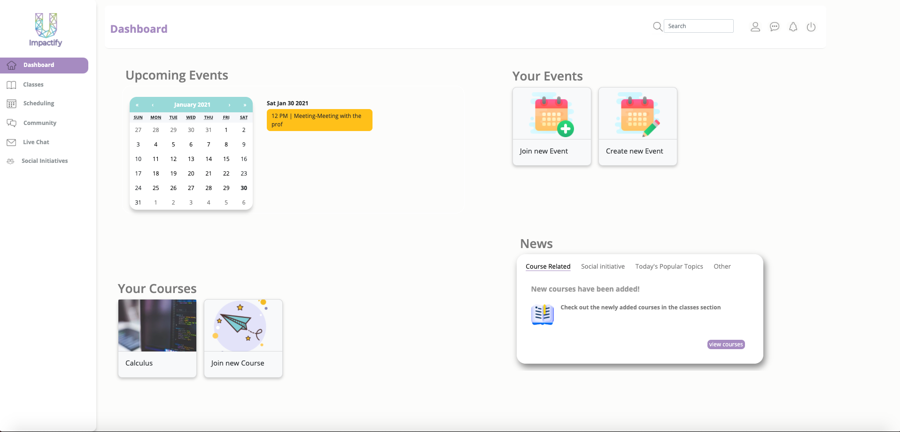
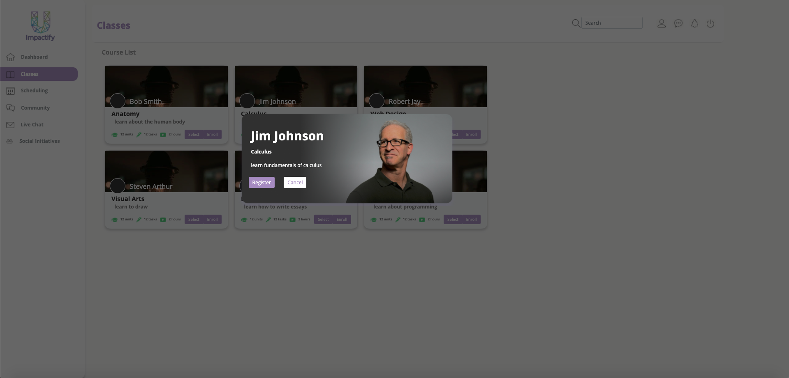
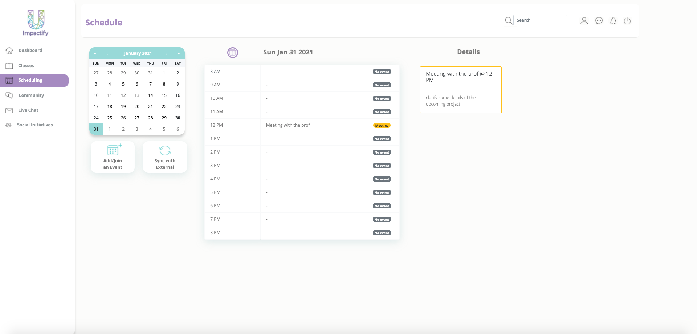
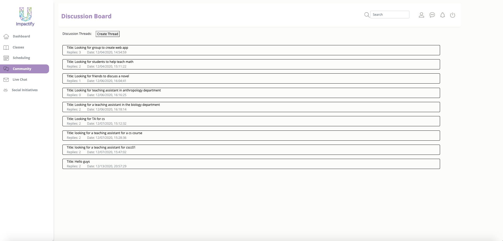
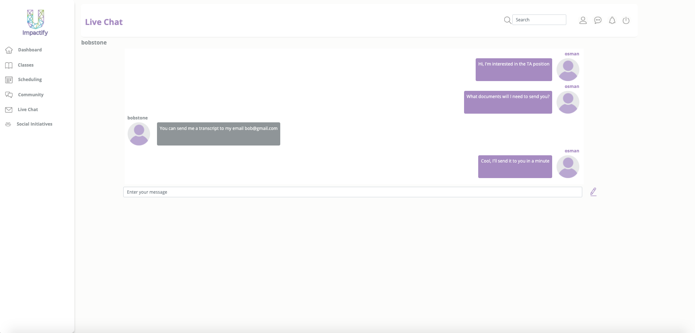
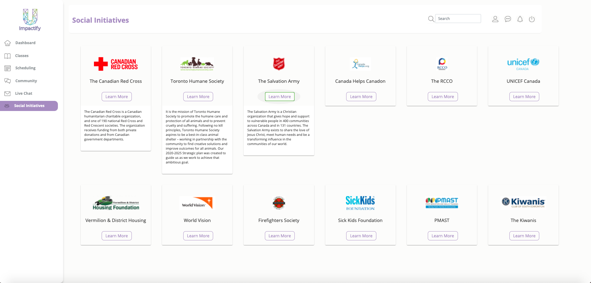

Prototype web application of an online learning platform developed for a local startup targeted towards non-profit organizations. The web application allows users to enroll into courses, interact with 
other students or instructors, manage their personal schedule and learn about social initiatives. 

